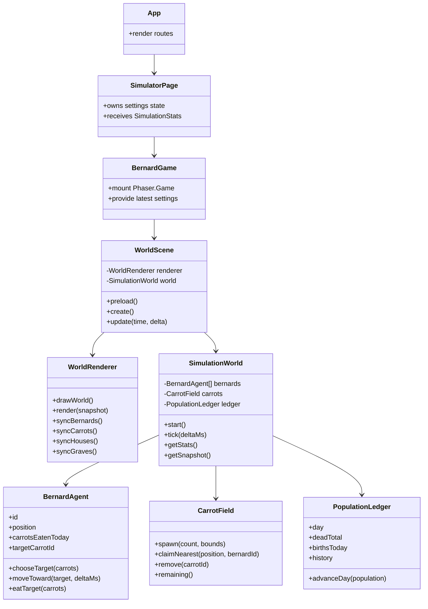

# Bernard Simulator

A tiny frontend-only life simulation where Bernards wake up, chase carrots, survive the day, and reproduce if they eat enough.

## Stack

- Vite + React + TypeScript
- Tailwind CSS through `@tailwindcss/vite`
- React Router with `HashRouter` for GitHub Pages-safe navigation
- Phaser for the 2D simulation canvas
- Vitest with an 80% global coverage gate
- GitHub Pages deployment through `gh-pages`

## Commands

```sh
make up
make test
make build
make deploy
make kill
```

`make up` installs dependencies if `node_modules` is missing, then starts Vite on port `5173`.
`make test` runs Vitest with V8 coverage and fails when global branches, functions, lines, or statements fall below 80%.

## Simulation Rules

- The simulation starts with 5 Bernards at the house.
- A default day lasts 30 seconds at `1x`, 15 seconds at `2x`, and 10 seconds at `3x`.
- Each Bernard seeks the nearest unclaimed carrot.
- Eating a carrot increments that Bernard's daily carrot count.
- Each day has a fixed carrot budget, defaulting to 40 total carrots.
- At day end:
  - Bernards below the survival threshold die.
  - Bernards at or above the survival threshold live into the next day.
  - Bernards at or above the reproduction threshold create one child.
- Survivors and newborns wake up at the house on the next day.

## Architecture

React owns the page layout, controls, and stat display. Phaser owns the canvas lifecycle and sprite rendering. The simulation world is now domain-level OOP so behavior stays testable without Phaser.

Pure simulation modules live in `src/simulation`:

- `SimulationWorld.ts` coordinates days, ticks, carrots, Bernards, graves, and stats.
- `BernardAgent.ts`, `CarrotField.ts`, and `PopulationLedger.ts` model the active world.
- `rules.ts` and `spawn.ts` keep survival/reproduction and placement rules small and reusable.
- `types.ts` contains shared data contracts.

The Phaser implementation lives in `src/game`:

- `BernardGame.tsx` mounts and destroys the Phaser game from React.
- `scenes/WorldScene.ts` delegates world state to `SimulationWorld`.
- `WorldRenderer.ts` and `TerrainPainter.ts` draw terrain and synchronize sprites.

React pages and reusable UI live in `src/pages` and `src/components`.



## Deployment

The app deploys to GitHub Pages with the custom domain `bernard.thefrenchartist.dev`.
The Vite base path is `/` because GitHub Pages serves the app at the domain root.
The custom hostname is stored in `public/CNAME`, which is copied into `dist` during builds.

```sh
make deploy
```

This runs the production build and publishes `dist` with `gh-pages`.
